# Installation [installing]
## Installing the Replay Mod [replaymod]
### Minecraft 1.14 and above
The **ReplayMod** for Minecraft 1.14 and above requires **Fabric** to be installed.

You can find Fabric and the installation instructions [here](https://fabricmc.net/use/).

After installing Fabric, simply put the downloaded ReplayMod .jar file into the `/mods` folder of your Minecraft directory.

### Minecraft 1.12.2 and below
For Minecraft 1.12.2 and below it requires **Minecraft Forge** to be installed.

If you don't know how to install Forge, follow [this tutorial](https://www.youtube.com/watch?v=4i7-RystzC4).

After installing Forge, simply put the downloaded `ReplayMod.jar` file in the `/mods` folder of your Minecraft directory.

> **Note:** The **Replay Mod** is entirely client side and can not be installed on the servers you play on.

## Installing FFmpeg [ffmpeg]
To render your creations with **Replay Mod** you will need to have FFmpeg installed.

### Windows [windows]
Download the latest FFmpeg build from <http://ffmpeg.zeranoe.com/builds/>. Make sure to select the latest release in the dropdown next to 'Version'. This will be a number like `4.3` or `4.3.1`. Choose the highest number.

In your `.minecraft` folder, create a `ffmpeg` folder. Extract the downloaded .zip file into this folder. The FFmpeg executable should end up at `.minecraft/ffmpeg/bin/ffmpeg.exe`.

### Mac OSX [mac]
On OSX, you can install **FFmpeg** with **[Homebrew](http://brew.sh/)** using `brew install ffmpeg`.

Alternatively, you can download the latest static build from <https://ffmpeg.org/> and copy the FFmpeg executable to `/usr/local/bin`.

### Linux [linux]
On Linux, you can install **FFmpeg** using your system's package manager, for example using `apt install ffmpeg`.
If in doubt, consult the documentation of your distribution.

## Settings [settings]
To access the **Replay Mod Settings** from the Main Menu click the **"Replay Viewer"** button and click the **Settings** button.

While playing, you can click the 'Mods' button in the Pause screen to reach **Replay Mod Settings** if you use Minecraft 1.12.2 and below, or have the mod [Mod Menu](https://www.curseforge.com/minecraft/mc-mods/modmenu) installed.

When in a Replay, you can either bind a hotkey to the **Replay Mod Settings** in Minecraft's Control settings
or use the hotkey GUI by clicking on the arrow button in the lower left corner.

# Recording [recording]

The **Recording Indicator** which is displayed while recording

Recording Replays is the core feature of the **Replay Mod**.

Recording a Replay is really simple: If enabled in the **Replay Settings**, the Mod will automatically record all of your gaming sessions.  
You will be notified that the Recording started by a **Chat Message**. Chat Messages can be disabled in the **Replay Settings**.  
In the upper left corner, a **Recording Indicator** will be displayed unless disabled in the **Replay Settings** while you are recording.

While Recording, you can set [Event Markers](#replaying-markers) using the `M` key.

Upon exiting your Server/Singleplayer World, you might be asked to wait a couple of seconds until saving the Replay has been finished.  
Congratulations, your Replay is now accessible via the **Replay Viewer**!

# Replaying [replaying]
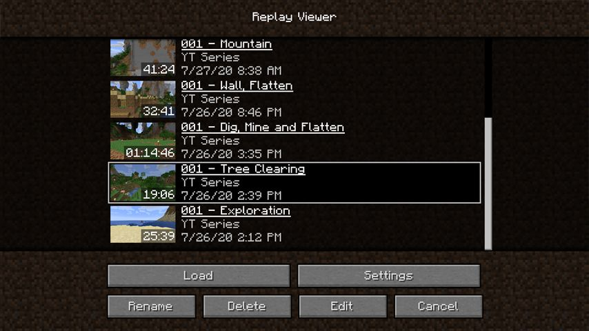
The **Replay Viewer** with several recorded Replays

To watch one of your Replays, open up the **Replay Viewer** from the **Main Menu** and select the desired Replay.
Then, press the "Load" button.

In the **Replay Viewer**, you can also **rename**, **delete** and **upload** your **Replay Files**.

## Movement [movement]
### Basic Controls [basic]
While in the Replay, you can freely move around using the movement keys (`WASD, Space, Shift` by default).
You can move through block similar to Spectator Mode.

Using the **Mouse Wheel**, you can modify your flying speed. Scrolling **up** causes you to fly faster, while scrolling **down** slows you down.

If you prefer the camera to be controlled similar to vanilla Creative Mode, you can change that in the **Replay Settings**.

### Camera Roll [roll]
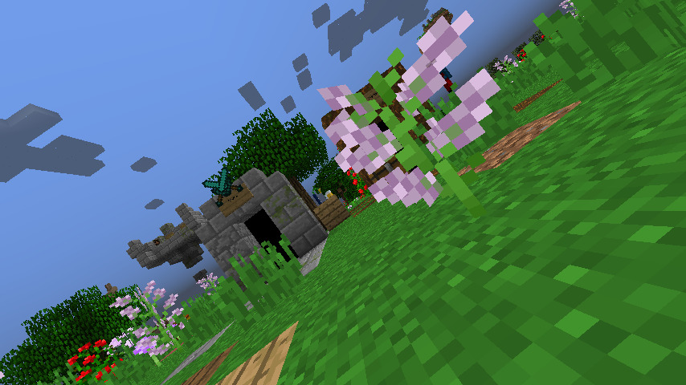
A Screenshot taken with a **tilted camera**

While in a Replay, you can tilt the Camera.

By default, pressing `J` will tilt the screen clockwise, and pressing `L` will tilt the screen counterclockwise.  
Using `K`, you can reset the Camera Roll.

When holding the `Ctrl` key (`Cmd` key on Mac) while tilting, you can tilt slower and more precisely.

> **Hint:** Most of the Keybindings mentioned in this documentation can be changed in Minecraft's **Control Menu**.

### Spectating Entities [spectating]
You can spectate any living entitiy (including players) while in a Replay. When looking at an entity, a crosshair will be visible.

By right-clicking, you will start spectating the entity. If you want to stop spectating the entity, use your Sneak Key (`Shift`).

## Controlling Time [time]
### Replay Speed [speed]

The **Play/Pause button**, **Speed Slider** and **Replay Timeline** hightlighted

In the upper left corner of you screen, there is a **Play/Pause button** (Shortcut: `P`), using which you can entirely pause the time of the Replay.  
All Entities, Particles and Block Updates will be frozen until you resume. You can fly through a paused Replay as usual.

Next to the Play/Pause Button, there is a **Speed Slider**. Using the **Speed Slider**, you can control how fast the time in your Replay passes.  
The minimum Speed value is **0.1 times** the normal Minecraft Tick Speed, and the maximum Speed is **8 times** as fast.

### Jumping in Time [travel]
To the right of the Speed Slider, there is the **Replay Timeline**.
On the Replay Timeline, you see a yellow cursor indicating your current position in the Replay.  
By clicking somewhere on this Timeline, you will travel in time towards the specified point in time.  
Please note that it takes longer to do larger steps in time or to jump backwards in time (see also [Quick Mode](#replaying-quickmode)).

## Camera Paths [paths]
### Introduction [intro]
While in a Replay, you can create controlled **Camera Movements** using the Mods's **Keyframe System**.  
Those Camera Paths can be rendered to a video later (see [Rendering](#replaying-render)).

The **Replay Mod Keyframe System** is similar to many Video Editing Software's Keyframe Systems.
If you're new to Keyframe Systems, try reading [this Wikipedia article](https://en.wikipedia.org/wiki/Key_frame).

### Keyframe Timeline [timeline]
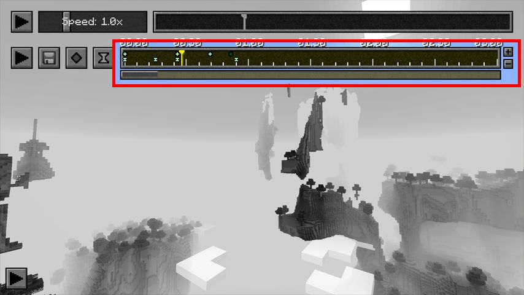
The **Keyframe Timeline** highlighted

All of the Keyframes which define a Camera Path are placed on the **Keyframe Timeline**.
The Keyframe Timeline is below the [Replay Timeline](#replaying-time-travel).

The **Keyframe Timeline** is 10 Minutes long, meaning a Camera Path can take up to 10 Minutes.
You can zoom in and out on the Keyframe Timeline using the `+` and `-` buttons next to it.

Other than the **Replay Timeline**, the **Keyframe Timeline**'s time values are not relative to the Replay's point of time, but refer to **real time**.  
If two Keyframes are 5 seconds apart, the Camera Path will take 5 seconds to interpolate between those Keyframes.

You can drag Keyframes on the **Keyframe Timeline** by left-clicking them, holding the mouse button and moving your mouse.

### Position Keyframes [place]
The basic components of a Camera Path are **Position Keyframes**.
A Position Keyframe stores a **Camera Position** (x, y, z, yaw, pitch, roll).

You can set a **Position Keyframe** using the "Add Position Keyframe"  button.  
A **Position Keyframe** initially contains the state the Camera was in when creating the Keyframe.

On the **Keyframe Timeline**, a **Position Keyframe** will appear at the cursors's current position.  
This Keyframe is selected automatically, and the **Position Keyframe Button** will turn red.
By clicking the **Position Keyframe Button** again, the selected **Position Keyframe** will be removed.

By adding multiple **Position Keyframes** on the **Keyframe Timeline**, you can create a simple **Camera Path**.  
Using the [Path Preview](#replaying-paths-place-preview), you can preview your **Camera Path**.

> **Hint:** By right-clicking a **Position Keyframe** on the **Keyframe Timeline**, you can jump to this Keyframe's Position.

#### Path Interpolation [interpolation]

A **Camera Path** using **Cubic Interpolation**

The same **Camera Path** using **Linear Interpolation**

By default, Camera Paths follow a smooth curve through all of the set **Position Keyframes**.
This curve is generated using [Cubic Spline Interpolation](https://en.wikipedia.org/wiki/Spline_interpolation).  
If you wish to disable smooth interpolation and want to make the Path follow straight lines instead, change the **Path Interpolation Setting** in the **Replay Settings**.

You can easily toggle between **Linear** and **Cubic Interpolation** using the `O` key.

#### Path Preview [preview]

While the **Path Preview** is enabled, this camera symbol is displayed in the lower right corner of the screen.

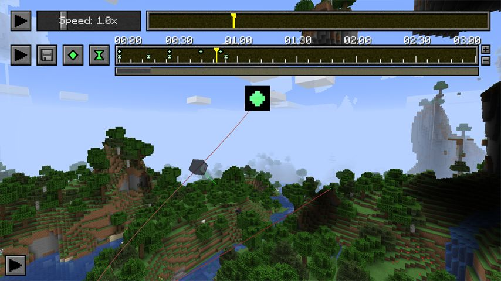
A normal **Path Preview**

Using the `H` key, you can toggle a **visual representation** of your Camera Path.
If enabled, you will see a **Red Line** in the World following the Camrea Path.

The [Path Interpolation Setting](#replaying-paths-place-interpolation) is respected in this preview.

By moving the cursor on the **Keyframe Timeline**, you can see the Camera's current positon and view direction on the **Path Preview**.

### Time Keyframes [time]
**Time Keyframes** can be used to precisely control time travelling during a **Camera Path**.

> Every Time Keyframe represents a timestamp in the Replay itself.

You can set a **Time Keyframe** using the "Add Time Keyframe"  button.  
A **Time Keyframe** initially contains the Replay's point in time when creating the Keyframe.

When playing the **Camera Path**, the Replay's time will interpolate between the set **Time Keyframes** in the Keyframes' intervals. Two **Time Keyframes** with the same Timestamp will freeze the Replay time for the duration of their interval.

> **Hint:** By right-clicking a **Time Keyframe** on the **Keyframe Timeline**, you can jump to this Keyframe's Timestamp Value.

> **Note:** Travelling backwards in time is not supported during **Camera Paths**. Do not add a **Time Keyframe** containing an earlier point in time after another **Time Keyframe**.

To play your first **Camera Path**, click the **Play Button** next to the **Keyframe Timeline**.  
By default, the **Camera Path** starts from the Cursor Position on the Keyframe Timeline.
By clicking while holding the `Ctrl` key (`Cmd` key on Mac), you can however start from the beginning regardless of the Cursor Position.

#### Synchronizing Timelines [sync]
Using the `V` key, you can **synchronize** the **Keyframe Timeline** with the time that passed since the last **Time Keyframe**'s timestamp.

This means that pressing `V` moves the **Keyframe Timeline**'s cursor to the position where placing a **Time Keyframe** would result in a **Replay Speed** of the **Speed Slider's current value** between the newly placed and the last **Time Keyframe**.

If holding `Shift` while synchronizing, it will be synchronized as if the **Speed Slider's value** was **1.0**.

### Spectator Keyframes [spectator]
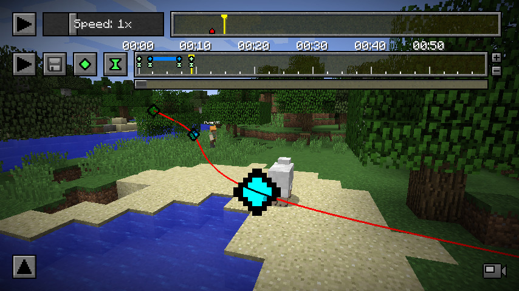
A **Path Preview** with **Spectator Keyframes**

While [spectating an entity](#replaying-movement-spectating), the "Add Position Keyframe" button becomes an "Add Spectator Keyframe"  button.

To sucessfully spectate an entity, you always need at least two **Spectator Keyframes** created while spectating the same entity.  
On the **Keyframe Timeline**, the periods during which you are spectating an entity are marked with a blue line.

To leave a spectated entity during a camera path, simply add a normal **Position Keyframe**.

### Editing Keyframes [edit]
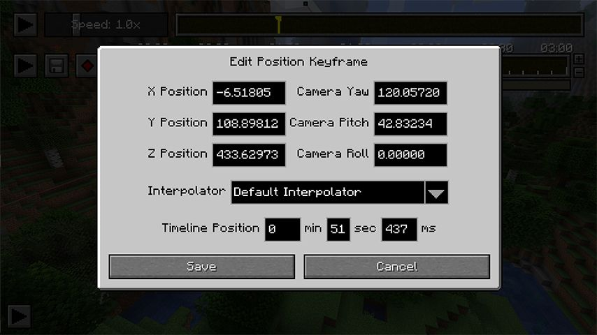
The **Keyframe Editor** for a **Position Keyframe**

You can edit any Keyframe by **double-clicking** it on the Keyframe Timeline.
A new GUI Screen will open which allows you to modify the Keyframe's properties.

On the lower part of the screen, you can precisely set the Keyframe's position on the **Keyframe Timeline**.  
Above that, you can modify Keyframe specific settings, for example its Position value.

### Removing Keyframes [remove]
Using the `DELETE` key, you can remove the currently selected Keyframe.  
Alternatively, while a Keyframe is selected, its connected Button turns red, and clicking it removes the Keyframe as well.

> **Note:** If you use an Apple Computer with a built-in keyboard, you  may need to press `FN + DELETE` instead.

### Keyframe Repository [repository]
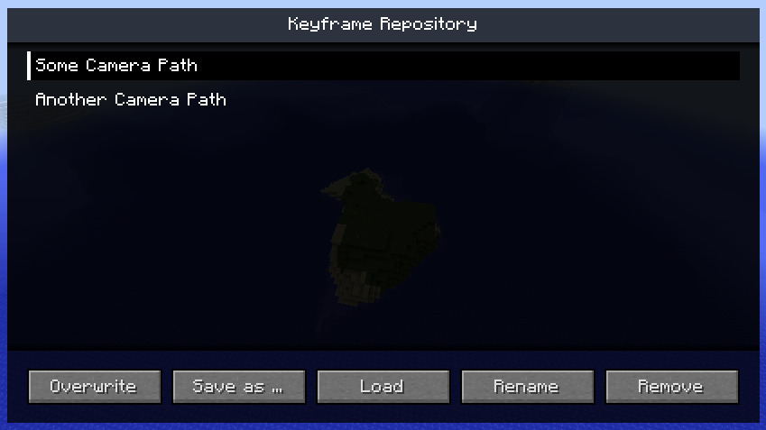
The **Keyframe Repository** with two **Path Presets**

[YouTube](IYrzbbIzWPw)

Using the `X` key, you can open the **Keyframe Repository**. Every Replay File has a separate Keyframe Repository which can contain several **Keyframe Presets**.

To save the Keyframes currently on your Timeline, click the **"Save as..."** button.
You can change a Preset's name, select it from the list and click the **"Rename"** button.
To load a Keyframe Preset, select a Preset from the list and click the **"Load"** button.
Using the **"Remove"** button, you can permanently delete a Keyframe Preset from the **Keyframe Repository**.

## Rendering [render]
With the **Replay Mod**, you can render **Camera Paths** to videos **without** using a screen recording tool like Fraps.  
To get started, first [set up your Camera Path](#replaying-paths) as described in the previous chapters.
Then, press the **"Render Camera Path"** button in the upper left corner.

### Rendering Method [method]
The **Replay Mod** does not only allow you to render "normal" vidoes as you see them on YouTube everyday,
you can also render **360 degree videos**, **3D videos** and more.  
To change the rendering method, use the dropdown on the upper half of the **Render Settings Screen**.

#### Default Rendering [default]
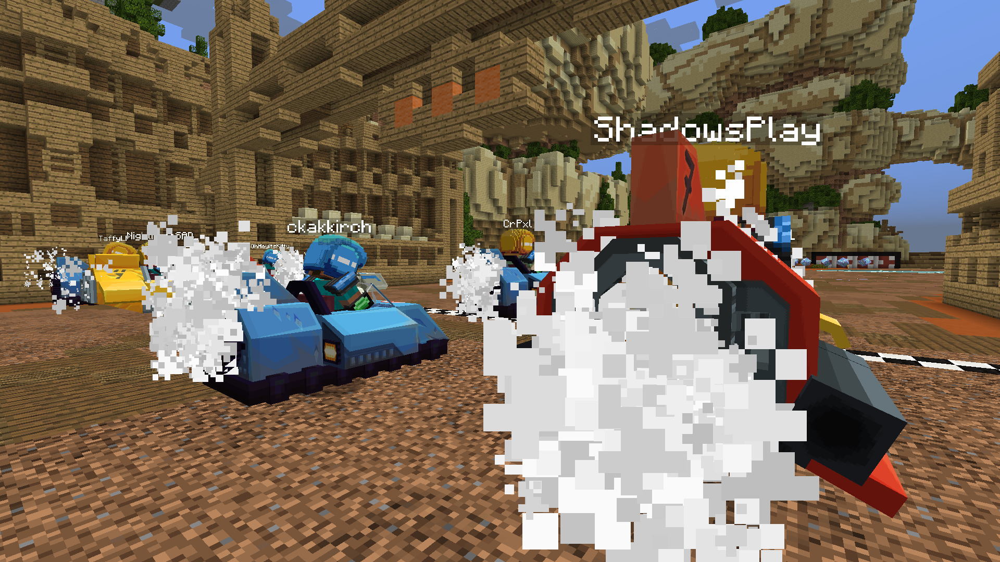
A frame exported using **Default Rendering**

Renders the video in the specified resolution. Fastest Rendering Option.

#### Stereoscopic Rendering [stereoscopic]

A frame exported using **Stereoscopic Rendering**

Renders the video as a [stereoscopic](https://en.wikipedia.org/wiki/Stereoscopy) (side-by-side) 3D move, usable by different 3D technologies. The image for one eye is half the width of the video.

#### Cubic Rendering [cubic]
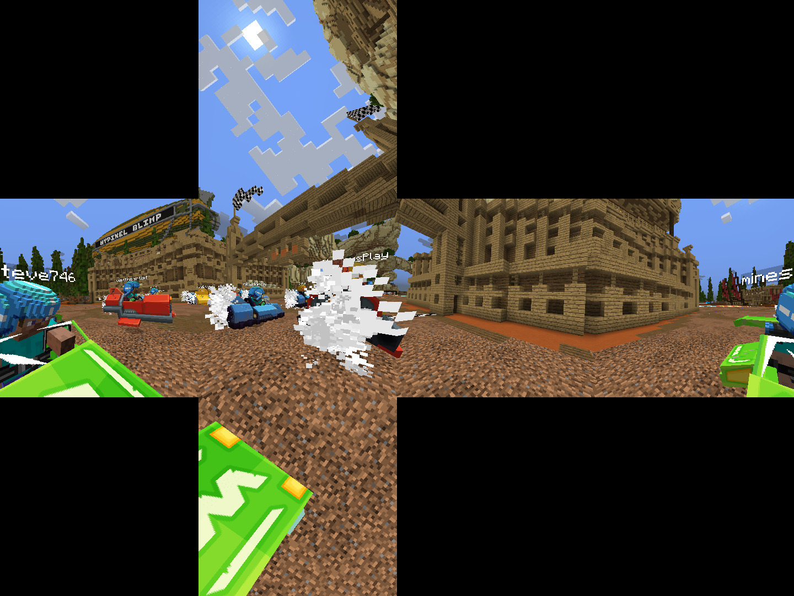
A frame exported using **Cubic Rendering**

Renders the video with a **360 degree panoramic view**, using [Cubic Projection](http://wiki.panotools.org/Cubic_Projection).
This is usable by several 360 degree video players (and the **Oculus Rift**), for example [VR Player](https://vrplayer.codeplex.com/).  
While **Cubic Videos** can't be used for **YouTube 360° Videos**, it takes less time to render them, so if your player 
is compatible with **Cubic Projection** anyway, you can use this setting.

#### Equirectangular Rendering [equirectangular]
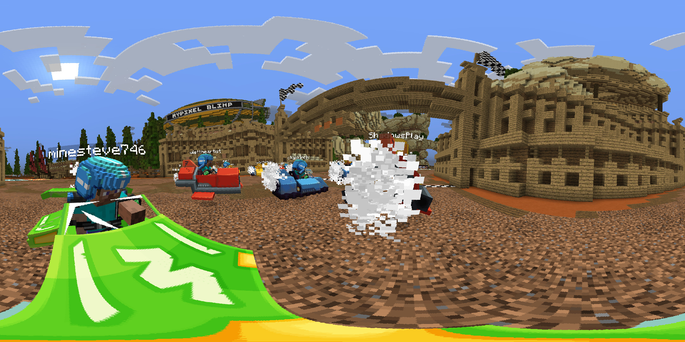
A frame exported using **Equirectangular Rendering**

Renders the video with a 360 degree panoramic view, using [Equirectangular Projection](http://wiki.panotools.org/Equirectangular_Projection).
This is usable by [YouTube's new 360 degree video function](https://support.google.com/youtube/answer/6178631?hl=en), and several video players (and the **Oculus Rift**), for example [VR Player](https://vrplayer.codeplex.com/).

> **Note:** In order for **YouTube** to recognize 360 Degree Videos, you have to inject some Metadata. Follow [this guide](https://support.google.com/youtube/answer/6178631?hl=en) for a tutorial.

### Video Settings [settings]
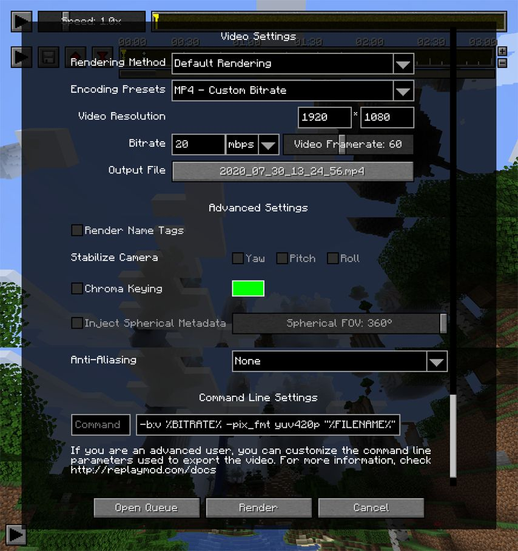
The **Video Render Settings** Screen

After you chose the **Rendering Mode** you want to use, you can further customize the rendered video.

#### Video Resolution [resolution]
Below the **Render Method** Dropdown, you can enter the desired **Video Resolution** (Width * Height).
You can enter any resolution there, but make sure to use reasonable values.

Common Video Resolutions for **Default Rendering** are:

- 720p - 1280 * 720
- 1080p - 1920 * 1080
- 4k - 3840 * 2160

---

When using **Stereoscopic Rendering**, please note that the entered **Width** value is the final video's width.
Because **Stereoscopic Videos** have two frames next to each other, you therefore need to **double** the video width,
so if you want a **Full HD Stereoscopic Video**, you have to enter **3840 * 1080**.

---

Videos in **Equirectangular Projection** always need to have an **Aspect Ratio** of **2:1**.

Please note that you should generally use a high resolution when exporting **Equirectangular Videos**, as the Video will be mapped onto a spherical surface in the Viewer you're using. To get a decent looking video, we recommend a resolution of **4320 * 2160**.

> **Note:** If you're re-rendering Equirectangular footage (e.g. using a video editing software like Premiere), make sure to export it at a **2:1** aspect ratio - otherwise it will look strange in 360 degrees.

#### Video Framerate [framerate]

#### Video Encoding and Quality [quality]
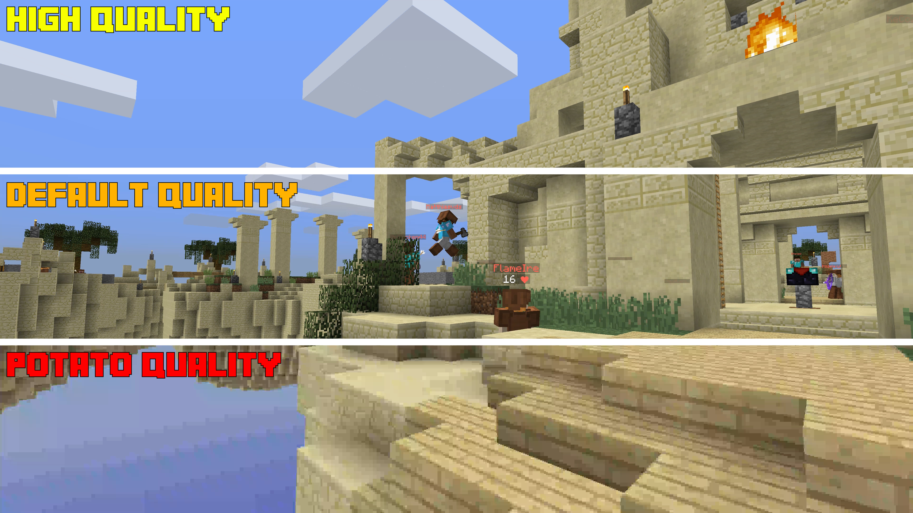
A comparison between the quality of the **MP4 Hight, Default and Potato** Quality Presets.

Below the **Render Method Dropdown**, there is another Dropdown Menu for **Encoding Presets**.

> **Note:** If you simply want to render an MP4 video in good quality, don't change these settings.

There are **7 Encoding Presets** you can choose from:

- **MP4 - Default Quality**  
  Renders an **MP4 video** encoded with the **x264 codec** in **Default Quality**.
  This is default Encoding Preset, as it exports a video with good quality and a relativly low file size.
- **MP4 - High Quality**  
  Renders an **MP4 video** encoded with the **x264 codec** in **High Quality**.
  Rendered videos have a relatively high file size, but their quality is almost lossless. This is useful for video producers who have to encode (render) their footage several times.
- **MP4 - Potato Quality**  
  Renders an **MP4 video** encoded with the **x264 codec** in **Very Low Quality**.
  While the video itself looks really bad, the file size is tiny and therefore this preset can be used for test renders.
- **MP4 - Custom Bitrate**  
  If this Preset is chosen, the **Bitrate Input Field** gets enabled and you can define the video's bitrate yourself.
  The rendered video is an **MP4 video** encoded with the **x264 codec**.
- **WEBM - Custom Bitrate**  
  If this Preset is chosen, the **Bitrate Input Field** gets enabled and you can define the video's bitrate yourself.
  The rendered video is a **webm video** encoded with the **vp8 codec**.  
  **webm video files** are useful if you want to upload footage directly to streaming services like YouTube, 
  as they usually don't have to convert **vp8-encoded videos** when processing them.
- **MKV - Lossless**  
  Renders an **MKV video** encoded with the **x264 codec** in **Lossless Quality**.
  While these video files are of perfect quality, most **non-FFmpeg-based video players and video editing software** (e.g. QuickTime Player, Sony Vegas and Adobe Premiere) can't play these videos. Therefore, you should instead use the **MP4 - High Quality** preset in most cases.
- **PNG Sequence**  
  Exports the sequence as individual frames in the **PNG Format**.  
  **Warning:** This can create a huge amount of files, so make sure to save them in a separate folder.

### Advanced Settings [advanced]
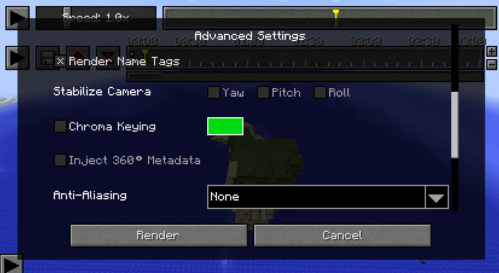
The **Advanced Render Settings**

#### Render Nametags [nametags]
If you don't want to see Entity's Nametags in the rendered video, simply un-tick the checkbox. Hidden Nametags also include Nametags of **Armor Stands** and **Mobs**, **not only Players**!

#### Stabilize Camera [stabilize]
This setting is only applicable for **Cubic Rendering** and **Equirectangular Rendering**.  
Because you can rotate the camera in **360 degree viewers**, a tilted camera persepctive leads to a strange user experience:
If the user looks around, his view might appear to be tilted because the camera looked up or down.
Therefore, it is recommended to **always stabilize the camera's Pitch and Roll** using the repsective checkboxes.

[Example 360° video **without stabilized Camera Pitch**](https://www.youtube.com/watch?v=lHGSG-0CVZw)  
[Example 360° video **with stabilized Camera Pitch and Roll**](https://www.youtube.com/watch?v=mtBehojUotQ)

#### Chroma Keying [chroma]
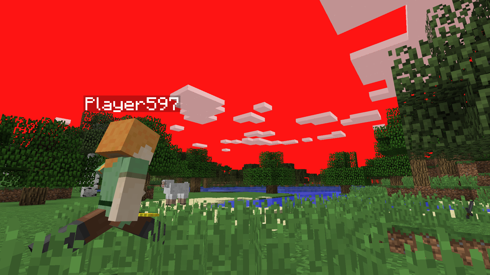
A screenshot of a video rendered with a **Red Chroma Key Setting**

This is an experimental setting for video producers which allows you to change the sky color to a fixed color.
Using a **Video Editing Software** like **Adobe After Effects** or **Sony Vegas**, you can change the sky color to transparency and add your own footage as sky. Read more about **Chroma Keying** [here](https://en.wikipedia.org/wiki/Chroma_key).

> **Note:** For best results, you should **disable clouds** before rendering, as they are transparent.

### Command Line Settings [commandline]
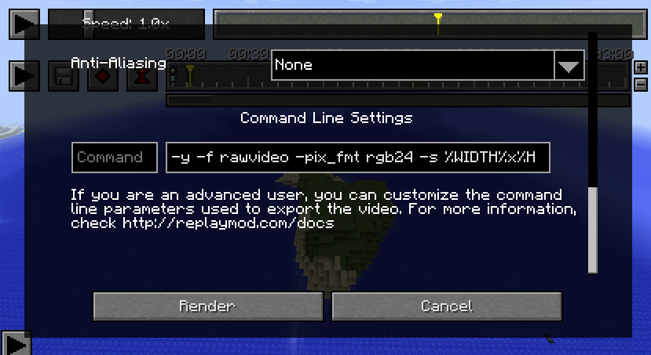
The **Command Line Render Settings**

> **Note**: This is for advanced users only. If you do not know what your're doing, leave these settings as they are.

The **Replay Mod** runs [FFmpeg](http://ffmpeg.org/) via the **Command Line** to encode videos.

You can customize both the **executed Command** and the **Command Line Arguments** in the **Command Line Settings** part of the **Render Settings Screen**.

#### Custom Command [command]
If you leave the left input field blank, `ffmpeg` will be used as **command**. If you haven't set your **PATH variable** to link to your FFmpeg distribution, simply enter the full path to your FFmpeg executable (e.g. `C:\ffmpeg\ffmpeg.exe` or `/usr/local/bin/ffmpeg`).

#### Command Line Arguments [arguments]
In the right input field, you can input custom **Command Line Arguments** to be used in the console.

Each of the **Encoding Presets** basically represents a set of **Command Line Arugments** which are used with the **ffmpeg Command**.
Customizing these **Command Line Arguments** allows you to use a specific codec or quality setting and much more.  
If you need an introduction to **ffmpeg Command Line Arguments**, read the [FFmpeg documentation](http://ffmpeg.org/ffmpeg.html).

Before passing the given **Command Line Arguments** to the **ffmpeg Command**, the **Replay Mod** replaces the following placeholders with your inputs in the **Render Settings Screen**:
- **%WIDTH%**  
  The video's width
- **%HEIGHT%**  
  The video's height
- **%FPS%**  
  The video's framerate
- **%FILENAME%**  
  The video's filename **without the extension**. This should be surrounded with quotation marks `"`, as the filename might contain spaces.  
  As the **ffmpeg Command** is always executed from the target file's parent directory, %FILENAME% does **not** contain the file's full path.
- **%BITRATE%**  
  The video's bitrate in **kilobytes per second**. As the %BITRATE% placeholder already contains the **value identifier "K"**,
  you don't have to take care of the bitrate value's format.

### Rendering Performance [performance]
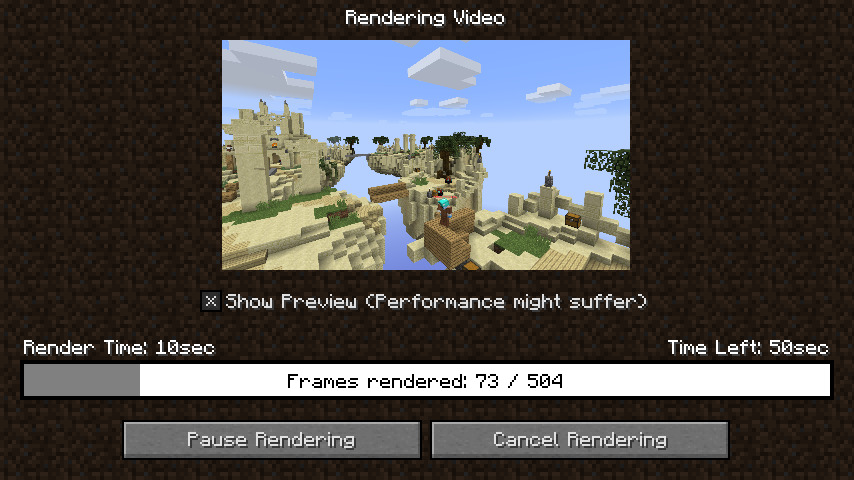
The Screen which is displayed while a video is being rendered

By clicking the **Render Button** in the lower right corner, you start **Default Performance Rendering**. Usually, this is perfectly satisfying regarding rendering speed, but you can increase it slightly using **High Performance Rendering**.

To use **High Performance Rendering**, hold down the `Ctrl` key  (`Cmd` key on Mac) while clicking the **Render Button**.  
**High Performance Rendering** has the following changes to improve rendering speed:
 - Rendering Process, Estimated Time Left and Button Clicks are not recalculated after every rendered frame,
   but only after one rendered seconds (e.g. every 60 frames when rendering with 60fps)
 - Resizing the Minecraft Window does not update the Rendering Gui

## Ambient Lighting [lighting]
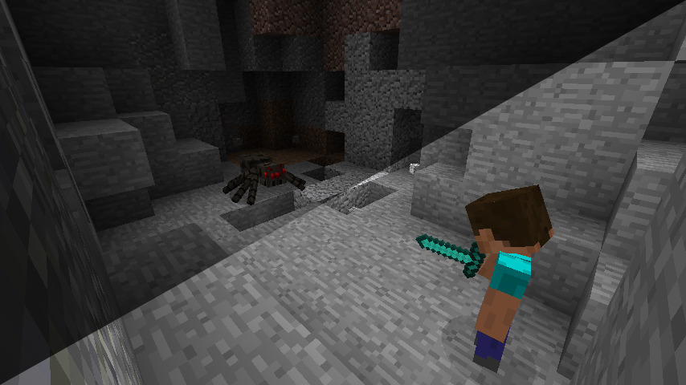
The same setting, onace with **Ambient Lighting** enabled, once with **Ambient Lighting** disabled

While **Ambient Lighting** is enabled, this eye symbol is displayed in the lower right corner of the screen.

If you have a Replay in a dark setting (for example at nighttime, or in a cave) and **Brightness: Bright** just isn't bright enough for you, you can toogle **Ambient Lighting** using the `Z` key (`Y` on some keyboards).

This works as a replacement for the **Night Vision Potion Effect**, without the side effect of a weird sky color.

## Quick Mode [quickmode] (Minecraft 1.9 and up)
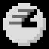
In **Quick Mode**, this clock symbol is displayed in the lower right corner of the screen.

When you first enable **Quick Mode** in a replay, an internal reference of certain entity and block properties is stored for quick access, allowing for faster navigation in the **Replay Timeline**.
As a side effect, certain features like particles and second skin layers will not be rendered in the preview.
By default, **Quick Mode** is toggled with `Q`.

## Player Overview [overview]
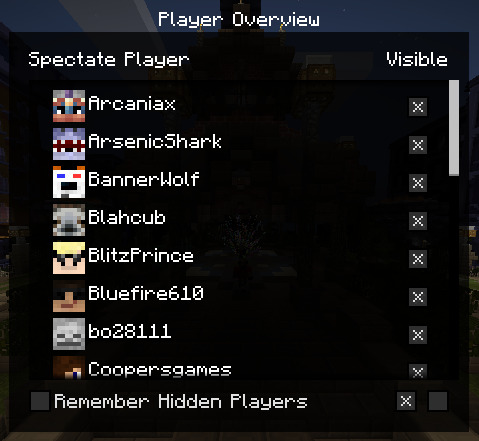
The **Player Overview** Screen

Using the `B` key, you can open the **Player Overview**. In the **Player Overview**, you see a list of all currently loaded **Players** in the Replay.

By clicking on a player's **Name or Head**, you can **spectate** this player.

Next to each player, there's a **checkbox** using which you can toggle the player's **visibility**.
This way, you can hide certain players from the Replay.  
Below the individual checkboxes, there are two checkbox buttons - one to **hide all players** and one to **show all players**.

If you want to **save the player visibility settings**, check **"Remember Hidden Players" checkbox**.
If checked, invisible players will stay invisible after closing the Replay (this can of course be reverted),
otherwise all of the players are visible again after reloading the Replay.

## Thumbnails [thumbnail]
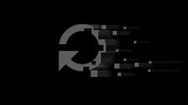
The **Default Thumbnail** which is used if no Thumbnail was created

While in a Replay, you can use the `N` key to create a **Thumbnail** of the current Replay.  
A **Thumbnail** is a Screenshot which should give the viewer a good impression of your Replay's content.

**Thumbnails** are important when uploading a Replay to the **Replay Center**,
as other users are much more likely to download your Replay if they can see a preview of it.  
They also help keeping your **Replay Viewer** clear and structured.

If no **Thumbnail** is set for a Replay, the **Default Thumbnail** will be displayed in the **Replay Viewer** and in the **Replay Center**.

## Event Markers [markers]

The **Replay Timeline** with several **Event Markers**

Long Replays easily get really clunky and difficult to handle.
Therefore, **Event Markers** are a simple way to mark important events in your Replay.

While [recording a Replay](#recording), you can press the `M` key anytime to set an **Event Marker**.
This **Event Marker** remembers the **Position** where you've added it and will later,
while watching a Replay, be displayed on the **Replay Timeline**.

While viewing a Replay, you can jump to an **Event Marker**'s Position and Timestamp by right-clicking it on the **Replay Timeline**.

You can also add new **Event Markers** while viewing a Replay using the `M` key as well.

You can name **Event Markers** by double-clicking them. 
When hovering over the **Event Marker**, its name is displayed.
This way, it's even simpler to add structure to your Replays.

You can **delete an Event Marker** by clicking it once to select it and then pressing the `DELETE` key.

# Frequently Asked Questions [faq]

### For how long can I record?
Theoretically, a Replay File can be up to **24 days, 20 hours, 30 minutes and 23 seconds** long - which is a timespan you'll probably never reach.

### How many chunks around me does the Mod record?
If you're playing in **Singleplayer**, all of the loaded chunks within your **Render Distance** are recorded.  
If you're on a server, this depends on the **view-distance** setting in the **server.properties** file, which is set to **11 Chunks** by default.

The Replay Mod of course records every **loaded**, not only the **rendered** chunks. Therefore, chunks behind your back are recorded as well.

### Why can't I start recording in the middle of a session?
Due to the way the **Replay Mod** works, you need to start recording when joining a **Server** or **World** - otherwise some data which the **Replay Files** need is missing.

### How does recording affect my FPS?
Usually, recording a Replay does **_not_** affect your framerate, and it also doesn't lead to lag on servers.  
We've tested the Mod on a low-end notebook with only **3GB of ram**, and everything worked fine.

### How big are the files the Replay Mod records?
The file size of the recorded **.mcpr files** greatly depends on the amount of world data the replay contains.  
A Replay in which you travelled around and discovered a lot of terrain is significantly larger than a Replay which was recorded in a void world.

An average Replay File of **10 Minutes duration** usually is between **2MB and 10MB large**.
Replays recorded on **Minigame Servers** with lots of particle effects and world changes might be larger.

# Troubleshooting [troubleshooting]
> If you have trouble with rendering, please first consult the Documentation before asking for help in the Discord.

## No FFmpeg installation found [ffmpeg]
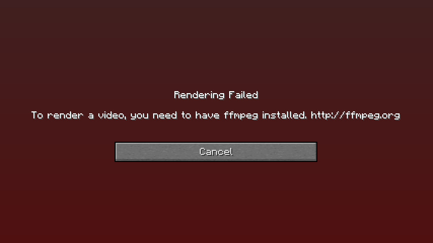
The error screen that is displayed when no FFmpeg installation could be found

If you have not installed FFmpeg, please follow the steps provided [here](#installing-ffmpeg)

If already have installed FFmpeg, you have to manually tell the **Replay Mod** where your FFmpeg executable is located.

First, get the full path to your `ffmpeg.exe` (on Windows) or `ffmpeg` executable (on Mac/Linux).  
On Windows, this path  might look like `C:\ffmpeg\ffmpeg.exe`.

Then, open the **"Command Line Settings" Section** in the Render Settings and paste this path into the **left input field** and retry rendering.

## Rendering Failed [libx264]
An error screen is displayed with FFmpeg error: `Unknown encoder 'libx264'`

The FFmpeg version you have installed is compiled without `--enable-_libx264_`. The 4.3 version on [https://ffmpeg.zeranoe.com/](https://ffmpeg.zeranoe.com/) has this issue. To fix it, install another version (e.g. the latest snapshot).

## Crash while rendering [crash]
If Minecraft crashes after a few frames of rendering, it most likely means the **FFmpeg** didn't like the **Command Line Arguments** you passed.
If you customized the Command Line Arguments manually, re-check them - it's probably your own fault.

> **Hint:** In your .minecraft folder, you'll find a file called `export.log` which contains information about FFmpeg's rendering process.

- If you did **not** customize the **Command Line Arguments**, you might have entered some insanely high (or low) values e.g. for Bitrate or Video Resolution. Try again with other, more reasonable values.
- Make sure the camera doesn't move below Y=0 or above Y=255

## Unsupported Launchers [launchers]
[Lunar Client](https://www.lunarclient.com/) does not support ReplayMod
[Badlion Client](https://www.badlion.net/) offers a different ReplayMod that is not the same as this one.

## Compatibility with other Mods [compatibility]
### General information [general]
In General, the Replay Mod _should_ be compatible with most Forge and Fabric Mods.

### Shaders Mod [shaders]
[Karyonix' Shaders Mod](http://www.minecraftforum.net/forums/mapping-and-modding/minecraft-mods/1286604-shaders-mod-updated-by-karyonix)
is no longer compatible with Minecraft Forge starting with 1.9.4. As such it is not compatible with the Replay Mod either.
Please use [Optifine](https://optifine.net/) instead.

### Custom Main Menu [custom-main-menu]
The [Custom Main Menu](https://www.curseforge.com/minecraft/mc-mods/custom-main-menu) mod is often used in mod packs to customize their Main Menu with a button layout fitting the background image, links to their website / bug tracker and similar.
If you are familiar with it, the button id for the Replay Mod is: **17890234** (text: `replaymod.gui.replayviewer`).

Due to the nature of this Custom Main Menu mod, buttons added to the Main Menu by 3rd party mods like the **Replay Mod** will not show up by default.  
Thus, to access the Replay Viewer/Editor/Center, you need to manually configure the position for those buttons.  
To do so, you need to modify the Custom Main Menu configuration file.
Usually, you can find it at `.minecraft/config/CustomMainMenu/mainmenu.json` (if you're using a mod pack launcher, it normally has its own .minecraft folder).  
For an explanation of this config file, have a look at Custom Main Menu's page.

You can find a list of already modified config files [here](https://gist.github.com/Johni0702/3f3fab81dbf7ada83d045d9fe8f345aa).

### Tickrate Changer [tickrate-changer]
The [Tickrate Changer](https://www.curseforge.com/minecraft/mc-mods/tickratechanger) mod may cause minecraft to freeze when you try to use the Replay Viewer UI.

### LabyMod [labymod]
The [LabyMod](https://www.curseforge.com/minecraft/mc-mods/labymod) is not compatible with ReplayMod.

